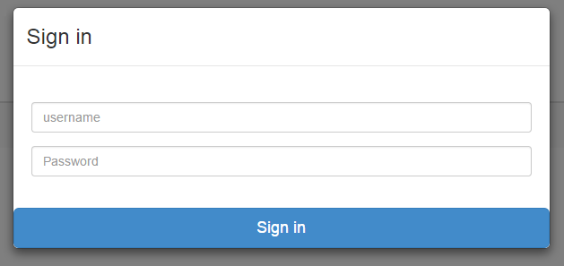

# Instant Rest API

Just add your database schema setup to database/db.js and database/config.js like the example and the api will be autogenerated for you.

Also openshift ready. Simply open an account and openshift.com, create a new nodejs application, and use this repository's git clone url as the starting repository.

Boom. Instant Rest API accessible from anywhere.

thanks to scotch.io for basic boilerplate

## Requirements

- Node and npm

## Installation

- Clone the repo: `git clone git@github.com:samachr/node-api.git`
- Install dependencies: `npm install`
- Start the server: `npm start` or `node server.js`

## Testing the API
npm start
go to http://localhost:3000 in a browser
default testing credentials are admin

